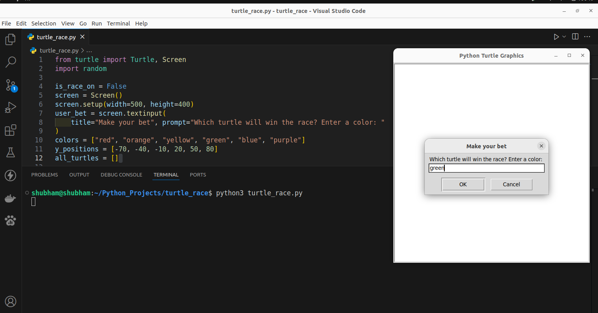
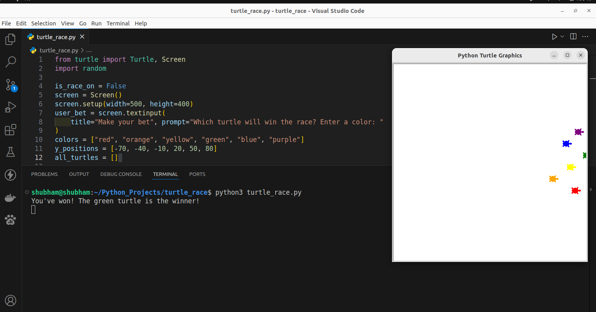

# Turtle Race Game

## Screenshots

This project is a Turtle Race Game created with [Python 3](https://www.python.org/downloads) using the Turtle graphics library. The game features multiple turtles in different colors racing across the screen, with each race having an unpredictable outcome due to random movement speeds. Players can place bets on which turtle will win, adding a fun interactive element. This project is great for learning Python basics, as well as concepts like loops, functions, and randomization with graphics.

##  ⚙️ Languages or Frameworks Used:

+ `pip install turtle`
+ `import random`

## 🌟 How to run:

+ Running the script is simple! Just open a terminal in the folder where your script is located and run the following command:

+ `python turtle_race.py`
